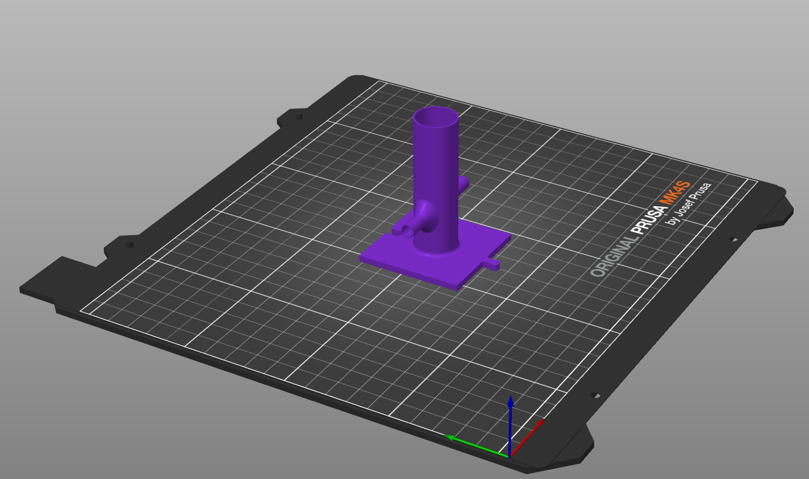

# V2 Cloud
Internet enabled and optimized OD sensor. 
Equipment list:
- Seeed XIAO ESP32S3 microcontroller with built-in wifi and Bluetooth capabilities
- 3D printed tube holder (TubeHolder V3 in 3D . Want to paraterize to make design easily customizable)

- TEMT6000 Photosensor
- 3D printed photosensor holder [or glue to secure photosensor]

- 591 nm LED [C503B-ACN-CY0Z0252-030]
- variable resistor (Need between 220 - 330 Ohms for optimal range of volatage values)
- Wiring

Experimental paarameteres set by setExperimentalParameters.py script. A Seeed XIAO ESP32S3 microcontroller with built-in wifi and Bluetooth capabilities reads these values and then sets them as parameters for timing. Seeed controls power to LEDs and connected devices, reads voltage from photosensor, and manages timing of connected devices. All referencce of Seeed in this document will be referring to the Seeed XIAO ESP32S3 microntroller. Seeed has flexible pins that can be specified as digital or analog. Digital means on or off. Analog means variable value. LED and photosensor connected and powered by pin set to digital output (3.3V). Voltage from photosensor read by pin set to analog input. 

# setExperimentalParameters.py
User prompted for:

 
Set max number of measurements? (NA voids)  
Set max run time in minutes? (NA voids)  
Set measuring time interval in seconds 
  

Set values are then uploaded to relevant field in thingspeak channel. These values will be read by Seeed device and used to determine how often voltage values are taken (measuirng time interval) and duration of experiment (determined by Max time or max number of measurments). Program takes 15 seconds between uploading each parameter as this is minimum refresh time of thingspeak channel.

Current thingspeak channel: https://thingspeak.mathworks.com/channels/2941358
How parameters appear in channel:

Voltage values are uploaded to Thingspeak channel (free IoT platform run by MATLAB).

## Project Libraries
All necessary Python libraries can be installed with the following command:
**
 pip install -r requirements_VWCloud.txt 
**  